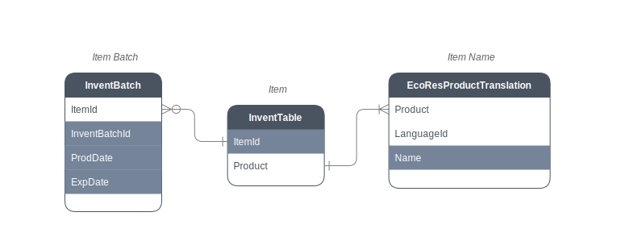

# Item Batch

<br />
<br />
<br />

## Entity Relationship
High-level overview of entity relationships

<br />
<br />
<br />



<br />
<br />
<br />

## SQL
This is for item batches

``` sql
SELECT TOP 1000 *
  FROM [dbo].[InventBatch] AS [INV_BTC]

       LEFT JOIN [dbo].[InventTable] AS [INV_ITM]
              ON [INV_ITM].[ItemId]      = [INV_BTC].[ItemId]
             AND [INV_ITM].[Partition]   = [INV_BTC].[Partition]
             AND [INV_ITM].[DataAreaId]  = [INV_BTC].[DataAreaId]
```
